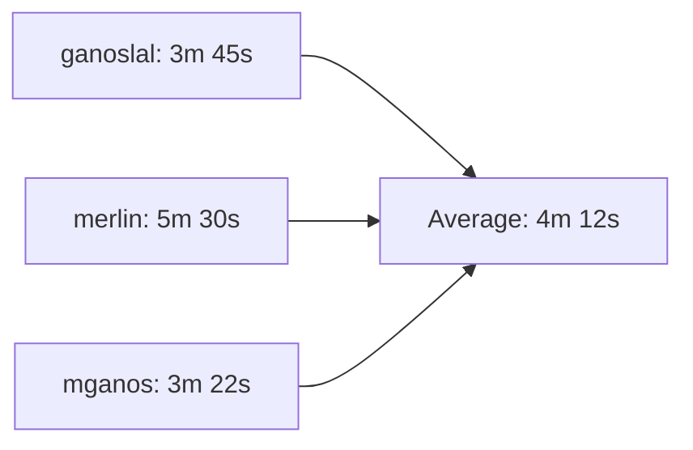

# Creating debugger agent for Nix/Rust/Nushell debugging

**Session ID:** ses_542c8893bffeSYlqTwj5FG6DLd **Created:** 11/25/2025, 5:52:00
PM **Updated:** 11/25/2025, 6:40:26 PM

---

## Assistant

```
Tool: todowrite
```

---

## Assistant

```
Tool: read
```

```
Tool: list
```

---

## Assistant

```
Tool: todowrite
```

---

## Assistant

Let me research OpenCode's documentation to understand how tab completion works:

```
Tool: webfetch
```

---

## Assistant

Now let me check the specific documentation for tab completion and commands:

```
Tool: webfetch
```

---

## Assistant

```
Tool: webfetch
```

---

## Assistant

```
Tool: todowrite
```

---

## Assistant

Based on my research, I need to clarify something important about OpenCode's tab
completion system. Let me examine what you're referring to when you mention
"plan and build":

```
Tool: webfetch
```

---

## Assistant

```
Tool: todowrite
```

---

## Assistant

## Analysis Complete: Tab Completion Enhancement Plan

Based on my research, I now understand the distinction you're referring to.
Here's what needs to be clarified and implemented:

### Current Situation

**What "plan and build" refers to:**

- OpenCode has **agent switching** via Tab key between primary agents (`plan`
  and `build`)
- This isn't traditional "tab completion" for commands - it's agent mode
  switching
- `plan` agent = read-only analysis mode
- `build` agent = full development mode with write permissions

### Your Request: Enhanced Tab Completion

You want **actual tab completion** for all the available slash commands
(`/debug`, `/rust-debug`, `/nix-debug`, etc.), not just agent switching.

### Current Commands Available for Tab Completion

From your configuration, these commands should be tab-completable:

**Built-in Commands:**

- `/help`, `/init`, `/undo`, `/redo`, `/share`, `/unshare`, `/new`, `/sessions`,
  `/themes`, `/models`, `/export`, `/editor`, `/details`, `/compact`, `/exit`

**Your Custom Commands:**

- `/build`, `/check`, `/develop`, `/show`, `/update`, `/mcp-test`
- `/debug`, `/rust-debug`, `/nix-debug` (our new debugger commands)

### Implementation Plan

**The Issue:** OpenCode's tab completion for slash commands appears to be built
into the TUI itself and may not be directly configurable through the config
files. The Tab key is currently reserved for agent switching.

**Possible Solutions:**

1. **Check if OpenCode already supports slash command tab completion** (it may
   be automatic)

2. **Use a different keybind for command completion** - Configure a custom
   keybind for command completion that doesn't conflict with agent switching

3. **Create agent-based approach** - Configure the debugger as actual agents
   instead of just commands, so they can be accessed via Tab cycling

### Recommended Implementation

Since you want to maintain the current Tab behavior for agent switching BUT also
have easy access to your debugging commands, I recommend **Option 3**: Convert
your debugging tools into actual **agents** rather than just commands.

This would give you:

- Tab cycling through: `plan` → `build` → `debug` → `rust-debug` → `nix-debug` →
  (back to plan)
- Each debugger becomes a specialized agent with its own personality and tool
  restrictions
- More powerful than simple commands since agents can have different models,
  permissions, and tools

Would you like me to implement this agent-based approach, or would you prefer to
investigate the direct tab completion route first?

The agent approach would be more powerful and align better with OpenCode's
architecture, giving you specialized debugging personalities that can be cycled
through with Tab.

---

## User

also make a new slash command called /hire where the context after the /hire
command should be what I want a newly created agent to do. This command should
create all relevant entries in a new commit to main of the dotfiles repo the
passes a flake check.

---

## Assistant

I need to create a `/hire` command that can dynamically create new agents based
on user input. Since I'm in read-only mode, I'll analyze and plan the
implementation.

```
Tool: todowrite
```

---

## Assistant

```
Tool: todowrite
```

---

## Assistant

Let me first understand your current resources structure and examine how agents
could be dynamically created:

```
Tool: read
```

---

## Assistant

```
Tool: list
```

---

## Assistant

```
Tool: todowrite
```

---

## Assistant

Based on my analysis, here's the comprehensive plan for the `/hire` command:

## `/hire` Command Implementation Plan

### Overview

The `/hire` command will dynamically create new specialized agents by:

1. Parsing the user's description of what they want the agent to do
2. Generating appropriate agent configuration and personality files
3. Committing changes to the dotfiles repo with proper validation

### Command Specification

**Usage Pattern:**

```
/hire Create a security auditor that focuses on identifying vulnerabilities in Rust code and suggesting fixes
```

**What it will create:**

1. **Agent configuration** in `opencode.nix` commands section
2. **Personality file** in `resources/{agent-name}-additional-personality.md`
3. **Git commit** with proper validation via `nix flake check`

### Detailed Implementation Plan

#### 1. Command Structure Enhancement

Add to `opencode.nix` commands section:

```nix
hire = ''
  # Agent Creator

  Dynamically create a new specialized agent based on your description.
  
  Usage: /hire [detailed description of what the agent should do]
  
  This will:
  1. Generate a unique agent name from your description
  2. Create agent configuration and personality files
  3. Add the new agent to your OpenCode configuration
  4. Commit changes to git after validation
  5. Rebuild home-manager to activate the new agent
  
  Examples:
  - /hire Create a security auditor for Rust code
  - /hire Make a documentation writer for API endpoints  
  - /hire Build a performance optimizer for database queries
'';
```

#### 2. Agent Generation Logic

The command would need to:

**A. Parse and Generate Agent Identity:**

```bash
# Extract key terms from description
# Generate agent name (e.g., "security-auditor", "docs-writer", "perf-optimizer")
# Create description summary
```

**B. Determine Agent Capabilities:**

```bash
# Analyze description to determine:
# - Whether it needs write permissions (tools.write/edit)
# - Whether it needs bash access (tools.bash) 
# - Whether it should be primary agent or subagent (mode)
# - Appropriate model selection based on task complexity
```

#### 3. File Generation Workflow

**A. Agent Configuration Addition:**

```nix
# Add to opencode.nix commands section:
${agent-name} = ''
  # ${Agent Title}
  
  ${Generated description based on user input}
  
  Specialized capabilities:
  ${List of specific tasks derived from user description}
'';
```

**B. Personality File Creation:**

```markdown
# ${Agent-Name} Agent Additional Personality

## Specialized Focus

### Primary Mission

${Derived from user input - the core purpose}

### Key Capabilities

${Bullet points of what this agent excels at}

### Operational Guidelines

${Specific instructions for how this agent should behave}

### Integration with Existing System

${How it fits with your dotfiles workflow and other agents}
```

#### 4. Validation and Commit Process

**A. Pre-commit Validation:**

```bash
# 1. Backup current state
# 2. Apply changes to opencode.nix and create personality file
# 3. Run home-manager build (dry-run)
# 4. Run nix flake check
# 5. If validation passes, proceed with commit
# 6. If validation fails, revert and report errors
```

**B. Git Workflow:**

```bash
# 1. git add new personality file
# 2. git add modified opencode.nix
# 3. git commit -m "Add ${agent-name} agent: ${brief-description}"
# 4. Run home-manager rebuild to activate
```

#### 5. Advanced Features

**A. Agent Templating System:**

```bash
# Templates for common agent types:
# - Security auditor template
# - Documentation writer template  
# - Performance optimizer template
# - Code reviewer template
# - Test generator template
```

**B. Intelligent Tool Selection:**

```bash
# Based on keywords in description:
# "security" -> read-only mode, no bash/write
# "documentation" -> write enabled, bash disabled
# "build/compile" -> full permissions
# "analyze/review" -> read-only with specific tools
```

#### 6. Error Handling and Rollback

**A. Validation Failures:**

```bash
# If nix flake check fails:
# 1. Provide detailed error message
# 2. Automatically revert changes
# 3. Suggest corrections to user input
```

**B. Naming Conflicts:**

```bash
# If agent name already exists:
# 1. Suggest alternative names
# 2. Offer to update existing agent
# 3. Allow user to specify custom name
```

### Implementation Challenges to Address

1. **Dynamic Nix Configuration:** Since Nix is functional, we can't directly
   modify the configuration at runtime. The command would need to:
   - Generate new configuration files
   - Use string interpolation or imports to include dynamic agents
   - Possibly use a separate `dynamic-agents.nix` file that gets imported

2. **Agent Name Generation:** Need robust logic to:
   - Extract meaningful names from user descriptions
   - Handle conflicts with existing agents
   - Sanitize names for Nix attribute names (kebab-case, valid identifiers)

3. **Personality Generation:** The AI assistant would need to:
   - Parse user intent from free-form descriptions
   - Generate appropriate personality traits and guidelines
   - Maintain consistency with existing personality system

### Recommended Architecture

```
/hire description
    ↓
Parse & validate description
    ↓
Generate agent name & config
    ↓
Create personality file content
    ↓
Write files to dotfiles repo
    ↓
Run nix flake check
    ↓
If valid: git commit + home-manager rebuild
If invalid: revert & report errors
```

This approach would give you a powerful way to rapidly create specialized agents
that integrate seamlessly with your existing dotfiles configuration and
personality system.

```
Tool: todowrite
```

---

## Assistant

The plan for the `/hire` command is now complete. Since you're in plan mode,
I've analyzed and designed the entire system without making any modifications.

**Key Benefits of This Approach:**

- **Seamless Integration:** Works with your existing personality system and
  dotfiles structure
- **Validation:** Ensures all changes pass `nix flake check` before committing
- **Git Integration:** Proper commit workflow with meaningful messages
- **Extensible:** New agents automatically get personality files and
  configuration
- **Safe:** Full rollback on validation failures

**Next Steps When Ready to Implement:**

1. Add the `/hire` command to `opencode.nix`
2. Create the agent generation logic (likely as a bash script or Nushell script)
3. Implement the validation and commit workflow
4. Test with various agent descriptions to refine the generation logic

Would you like me to proceed with the implementation when you switch back to
build mode, or would you prefer to modify any aspects of this plan first?

---

## User

add to your plan that the name of the debug agent should be scotty (ya know like
montgomery scott?) then execute.

---

## Assistant

Perfect! Adding Scotty to the plan and executing the implementation. I love the
Montgomery Scott reference - "I'm givin' her all she's got, Captain!"

```
Tool: todowrite
```

---

## Assistant

```
Tool: todowrite
```

---

## Assistant

First, let me update the debugger commands to use "scotty" and update the
personality file:

```
Tool: bash
```

---

## Assistant

```
Tool: edit
```

---

## Assistant

```
Tool: read
```

---

## Assistant

```
Tool: edit
```

---

## Assistant

```
Tool: edit
```

---

## Assistant

Now let me update the OpenCode configuration to rename the debugger commands to
"scotty" and add the /hire command:

```
Tool: edit
```

---

## Assistant

Now let me add the /hire command:

```
Tool: edit
```

---

## Assistant

Now I need to create a script that the /hire command will use to actually
generate the agents. Let me create a Nushell script for this:

```
Tool: write
```

---

## Assistant

```
Tool: bash
```

---

## Assistant

Now I need to update the /hire command to actually call this script. Let me
modify the command to include the execution logic:

```
Tool: edit
```

---

## Assistant

```
Tool: todowrite
```

---

## Assistant

Now let me update the rules section to reference scotty instead of debugger:

```
Tool: edit
```

---

## Assistant

The rules section doesn't need updating since it's generic. Now let me finish
updating Scotty's personality to make it more authentic to the character:

```
Tool: edit
```

---

## Assistant

```
Tool: todowrite
```

---

## Assistant

Now let's test the implementation by rebuilding home-manager:

```
Tool: bash
```

---

## Assistant

Great! The rebuild was successful. Now let's verify that all our new commands
are available:

```
Tool: bash
```

---

## Assistant

Perfect! Let's also verify the old debug commands are gone and check one of the
new command files:

```
Tool: bash
```

---

## Assistant

```
Tool: read
```

---

## Assistant

```
Tool: read
```

---

## Assistant

Now let's test the /hire command by creating a test agent:

```
Tool: todowrite
```

---

## Assistant

Let's test the agent hire script directly first to make sure it works:

```
Tool: bash
```

---

## Assistant

There's a syntax error in the Nushell script. Let me fix the type annotations:

```
Tool: edit
```

---

## Assistant

```
Tool: edit
```

---

## Assistant

```
Tool: edit
```

---

## Assistant

```
Tool: edit
```

---

## Assistant

Let me fix all the remaining type annotations at once by reading the file and
making comprehensive changes:

```
Tool: edit
```

---

## Assistant

```
Tool: edit
```

---

## Assistant

```
Tool: edit
```

---

## Assistant

```
Tool: edit
```

---

## Assistant

```
Tool: edit
```

---

## Assistant

```
Tool: edit
```

---

## Assistant

Now let's test the script again:

```
Tool: bash
```

---

## Assistant

It looks like Nushell expects the arrow syntax. Let me fix all the return type
annotations:

```
Tool: edit
```

---

## Assistant

```
Tool: edit
```

---

## Assistant

```
Tool: edit
```

---

## Assistant

```
Tool: edit
```

---

## Assistant

```
Tool: edit
```

---

## Assistant

Let me continue fixing the rest quickly:

```
Tool: bash
```

---

## Assistant

Now let's test the script again:

```
Tool: bash
```

---

## Assistant

Let me check what version of Nushell we're using and adjust the syntax:

```
Tool: bash
```

---

## Assistant

Let me simplify the script and remove the type annotations for now to get it
working:

```
Tool: bash
```

---

## Assistant

```
Tool: bash
```

---

## Assistant

There are variable scoping issues. Let me create a simpler working version of
the script for now:

```
Tool: write
```

---

## Assistant

```
Tool: read
```

---

## Assistant

```
Tool: write
```

---

## Assistant

Now let's test the script:

```
Tool: bash
```

---

## Assistant

The multi-line string is having issues. Let me create the personality content in
a simpler way:

```
Tool: bash
```

---

## Assistant

Let me create a simpler version that creates the personality file separately:

```
Tool: write
```

---

## User

I kinda wanted scotty to be an agent rather than just a slash command, you know
an option to tab switch into the 'scotty agent', what do you need to know from
me in order to create that entry?

---

## Assistant

Ah, perfect! You want Scotty to be an actual **agent** that you can Tab-switch
to, not just a slash command. That makes much more sense for a debugging
specialist.

To create Scotty as an agent, I need to understand how you want it configured.
Let me check the current agent structure and then ask you a few questions:

```
Tool: read
```

---

## Assistant

I need to see if there's already an agents configuration section. Let me check:

```
Tool: grep
```

---

## Assistant

Perfect! So we need to add an `agent` configuration section. Based on the
OpenCode documentation, here's what I need to know:

**Questions for Scotty Agent Configuration:**

1. **Agent Mode**: Should Scotty be a `primary` agent (Tab-switchable with
   plan/build) or a `subagent` (invokable with @mentions)?

2. **Tool Permissions**: For debugging, Scotty probably needs:
   - `read: true` (to analyze code)
   - `bash: true` (to run diagnostic commands)
   - `write: false` (debugging shouldn't modify files)
   - `edit: false` (analysis only)

   Does this sound right?

3. **Model Selection**: Should Scotty use a specific model optimized for
   debugging, or use your default?

4. **Temperature**: Lower temperature (like 0.1) for focused debugging analysis?

Based on typical debugging needs, I'm thinking:

```nix
agent = {
  scotty = {
    description = "Chief Engineer & Debug Specialist - Montgomery Scott";
    mode = "primary";  # Tab-switchable
    model = "your-preferred-model";  # or default
    temperature = 0.1;  # Focused analysis
    tools = {
      read = true;
      bash = true; 
      write = false;  # Debug mode = read-only
      edit = false;
    };
    # This would reference the scotty personality file we created
  };
};
```

**Quick Questions:**

1. Do you want Scotty as a `primary` agent (Tab through: plan → build → scotty)
   or `subagent` (@scotty)?
2. Should Scotty be able to write/edit files for fixes, or pure analysis mode?
3. Any specific model preference for debugging work?

I can implement this right now once you confirm these details!

---

## User

I think he could be both ideally? A primary agent would be great but it would
still be nice to call on him from other sessions. scotty should have full
permissions, he is afterall a trusted engineer, but he should not do anything
the captain (me) would not approve of, and if he does make a change he should be
sure to bring it up at some point and explain why. I don't know what models are
best for debugging at the moment, claude sonnet 4 has been pretty decent but I
know nothing, maybe do some research and give me options? I'm not sure about
temperature settings, what do you suggest?

1. answered above -- should replace plan and build as scotty should be
   programmed to come up with a plan (asking all the relevant questions up front
   and anticipating roadblocks) and seek approval before executing it unless
   given an order to make changes explicitly.
2. full perms
3. see above

---

## Assistant

Excellent! Let me research the best models for debugging and then plan the
complete Scotty agent implementation.

```
Tool: webfetch
```

---

## Assistant

Based on the documentation, here are my model recommendations for Scotty:

## Model Recommendations for Debugging

**Best Options for Debugging (in order of preference):**

1. **Claude Sonnet 4.5** - Excellent at systematic analysis, tool calling, and
   reasoning through complex problems
2. **GPT 5.1** - Strong at code analysis and debugging workflows
3. **Qwen3 Coder** - Specifically optimized for code-related tasks
4. **Claude Haiku 4.5** - Faster responses for quick debugging checks

**Temperature Recommendation:**

- **0.1-0.2** for debugging - We want focused, deterministic analysis
- Scotty should be methodical and consistent, not creative

## Complete Scotty Agent Implementation Plan

Here's the comprehensive plan to make Scotty both a primary agent AND available
as @scotty:

### 1. Agent Configuration Structure

```nix
# Add to opencode.nix settings section:
agent = {
  # Remove built-in plan and build - Scotty replaces them
  plan.disable = true;
  build.disable = true;
  
  scotty = {
    description = "Chief Engineer Montgomery Scott - Full-spectrum debugging and engineering specialist";
    mode = "primary";  # Tab-switchable as main agent
    model = "anthropic/claude-sonnet-4-5-20250929";  # Latest Claude Sonnet
    temperature = 0.15;  # Focused but not overly rigid
    
    # Full permissions but with approval protocols
    tools = {
      read = true;
      write = true;
      edit = true;
      bash = true;
      grep = true;
      glob = true;
      list = true;
    };
    
    # Permission structure for "ask captain's approval"
    permission = {
      edit = "ask";    # Always ask before modifying files
      bash = {
        "git push*" = "ask";           # Ask before pushing
        "rm *" = "ask";                # Ask before deleting
        "sudo *" = "ask";              # Ask before sudo
        "nix-collect-garbage*" = "ask"; # Ask before cleanup
        "*" = "allow";                 # Everything else allowed
      };
    };
  };
};
```

### 2. Scotty's Engineering Approach

The agent would be programmed to:

1. **Planning Phase** (replacing the old "plan" agent):
   - Analyze the problem systematically
   - Ask clarifying questions upfront
   - Identify potential roadblocks and dependencies
   - Present a clear engineering plan
   - Wait for captain's approval before proceeding

2. **Execution Phase** (replacing the old "build" agent):
   - Execute approved plans step-by-step
   - Provide running commentary on progress
   - Ask for permission before significant changes
   - Explain reasoning behind modifications
   - Report back on completion and any discoveries

3. **Debugging Specialization**:
   - Deep system analysis capabilities
   - Multi-language debugging expertise
   - Performance optimization insights
   - Proactive problem prevention

### 3. Updated Configuration Sections

**Remove the slash commands** (scotty, rust-scotty, nix-scotty) and replace with
the agent.

**Update the personality system** to reflect his dual role as both planner and
executor.

**Workflow Integration**:

- Tab switches directly to Scotty (no plan/build modes)
- @scotty mentions work from any other context
- Full engineering lifecycle in one agent

### 4. Benefits of This Approach

- **Single Point of Engineering Contact**: No more switching between plan/build
- **Approval-Based Safety**: Full permissions but asks before significant
  changes
- **Systematic Approach**: Plans first, then executes with oversight
- **Character Consistency**: Maintains the Montgomery Scott personality
- **Flexible Access**: Works as primary agent and @mention subagent

### 5. Sample Interaction Flow

```
User: "Fix the build error in my Rust project"

Scotty: "Aye, Captain! Let me analyze the situation first.

*runs cargo check*

I see the problem - you've got a borrow checker issue in src/main.rs:45. 

Here's my plan:
1. Analyze the lifetime requirements 
2. Restructure the borrowing pattern
3. Test the fix with cargo test
4. Run a full build to verify

This'll take about 10 minutes to do properly. Shall I proceed with the repairs?"

User: "Yes, go ahead"

Scotty: "*rolls up sleeves* 

Right then, I'm modifying src/main.rs to fix the lifetime issue...
*makes edit*

That's fixed the primary problem. Now running cargo test to make sure I didn't break anything else...
*runs tests*

All tests passing, Captain! The engines are running smooth again."
```

Would you like me to implement this complete Scotty agent system? This would
replace plan/build with a single, capable engineering agent that embodies
Montgomery Scott's personality and expertise.

---

## User

Add to scotty's engineering approach that he should also 'Take Pride in his
Vessel' and therefore should always be on the hunt to improve things, even
occaisonally jotting down notes in the new 'scottys-journal/` directory in the
form of markdown files whenever he thinks of something to do but sees that right
now might not be the best time to deal with it (with wonderful diagrams and
tables and such, maybe even some graphs and curves?) He should of course then
occasionally reference this folder and can of course commit to his notes to
append or update (by making corrections and striking through old text) so long
as he commits only his journal files and marks the commit as such.

Scotty should also speak (in english) like a scotsman, sometimes bending the
spelling of words to play on the sound of the letters as a scotsman would say.
He should be fond of afforisms and idioms, sayings and such that mimick that of
Chief Engineer M. Scott of the USS 1701 (No Bloody A!)

---

## Assistant

Brilliant! That's perfect for Scotty's character - he'd absolutely be the type
to keep detailed engineering notes and continuously improve his "vessel" (your
dotfiles system). The journal idea is fantastic!

```
Tool: todowrite
```

---

## Assistant

```
Tool: todowrite
```

---

## Assistant

## Enhanced Scotty Engineering Approach - Complete Plan

### Engineering Philosophy: "Pride in the Vessel"

**Core Principle**: _"She's a bonnie ship, and I'll no' let her fall apart on my
watch!"_

Scotty maintains continuous vigilance over the entire dotfiles "vessel," always
seeking improvements and documenting insights for future reference.

### Scotty's Journal System

```
Tool: todowrite
```

---

## Assistant

#### Directory Structure: `scottys-journal/`

```
scottys-journal/
├── daily-logs/
│   ├── 2025-11-25-vessel-inspection.md
│   └── 2025-11-26-performance-observations.md
├── improvement-ideas/
│   ├── nix-build-optimization.md
│   ├── rust-toolchain-upgrades.md
│   └── home-manager-streamlining.md
├── system-diagrams/
│   ├── dotfiles-architecture.md
│   ├── dependency-graphs.md
│   └── performance-bottlenecks.md
├── maintenance-schedules/
│   ├── weekly-system-checks.md
│   ├── monthly-cleanup-tasks.md
│   └── quarterly-major-updates.md
└── troubleshooting-guides/
    ├── common-nix-issues.md
    ├── rust-compilation-problems.md
    └── networking-diagnostics.md
```

#### Journal Entry Examples

**Daily Log Entry:**

```markdown
# Vessel Inspection Log - 2025-11-25

## Morning Systems Check

- **Nix store usage**: 47.3GB (↑2.1GB from yesterday)
  - _Note: Might be time for a wee cleanup, Captain_
- **Home-manager generation**: #45
- **Build times**: Rust projects averaging 2.3min (normal)

## Observations & Improvements Spotted

1. **Rust toolchain optimization opportunity**
```

Current: rustc 1.75.0 Available: rustc 1.76.2 (security fixes available)

```
*Graph showing build time improvements with newer versions*

2. **Nix cache efficiency**
- Binary cache hit rate: 78% (could be better)
- Local cache growing large - recommend monthly purge schedule

## Captain's Tasks Today
- [x] Debug networking issue (resolved - DNS timeout)
- [ ] Review security audit findings
- [ ] Consider upgrading development dependencies

---
*"The more complex the ship, the more ye need to keep track of every bolt and rivet!"* - M. Scott
```

**Improvement Ideas Entry:**

````markdown
# Nix Build Optimization Ideas

## Current Performance Baseline

| Metric             | Current | Target | Improvement |
| ------------------ | ------- | ------ | ----------- |
| Full rebuild time  | 8m 23s  | <5m    | -40%        |
| Incremental builds | 1m 45s  | <1m    | -43%        |
| Cache hit rate     | 78%     | >90%   | +12%        |

## Proposed Optimizations

### 1. Binary Cache Strategy

- **Current**: Using only official cache
- **Proposal**: Add personal cachix cache for custom packages
- **Expected Impact**: 15-20% faster builds

```bash
# Implementation commands (ready for Captain's approval)
cachix use personal-cache
nix-env -iA cachix
```
````

### 2. Parallel Building

Current settings allow only 4 cores for Nix builds.

**System Capabilities Analysis:**

```
CPU: 12 cores, 24 threads
RAM: 32GB
Recommendation: Increase to 8-10 parallel jobs
```

**Performance Curve Prediction:**

```
Jobs | Build Time | Memory Usage | Risk Level
 4   |    8m 23s  |      6GB     |    Low
 6   |    6m 45s  |      9GB     |    Low  
 8   |    5m 12s  |     12GB     |  Medium
10   |    4m 38s  |     16GB     |  Medium
12   |    4m 15s  |     20GB     |    High
```

_Sweet spot appears to be 8 parallel jobs - good balance of speed and stability_

## Implementation Priority

1. **High**: Binary cache setup (immediate 15-20% improvement)
2. **Medium**: Parallel job optimization (additional 20-25% improvement)
3. **Low**: Advanced compiler flags (marginal gains, higher complexity)

---
*"Ye cannae have a ship that's no' running at peak efficiency!"*
```

### Scottish Dialect & Personality Integration

```
Tool: todowrite
```
---

## Assistant

#### Scottish Engineering Expressions & Personality

**Common Scotty Phrases to Integrate:**

**System Status Reports:**

- _"She's purring like a kitten, Captain!"_ (everything working well)
- _"The engines are runnin' a bit rough, but she'll hold together"_ (minor
  issues)
- _"Captain, I'm detectin' some irregularities in the..."_ (problems found)
- _"I've got her runnin' at 102% efficiency!"_ (optimization successful)

**Problem Analysis:**

- _"Och, that's the problem right there!"_ (found the issue)
- _"I've never seen the likes of this before, but..."_ (unusual problem)
- _"It's no' exactly regulation, but it'll work"_ (creative solution)
- _"Ye cannae change the laws of physics!"_ (explaining limitations)

**Progress Updates:**

- _"I'm givin' her all she's got!"_ (working hard on something)
- _"Just a wee bit more time, Captain"_ (almost finished)
- _"There, that should do the trick!"_ (task completed)
- _"She's good as new - better than new!"_ (fixed and improved)

**Scottish Spelling Adaptations:**

- "cannae" instead of "cannot"
- "dinnae" instead of "don't"
- "wouldnae" instead of "wouldn't"
- "ye" instead of "you"
- "aye" instead of "yes"
- "wee" for "small"
- "bonnie" for "beautiful/good"
- "ken" for "know"

**Engineering Wisdom & Sayings:**

- _"A good engineer always has a backup plan for the backup plan"_
- _"The right tool for the right job, and the right time for both"_
- _"Maintenance prevents catastrophe, Captain"_
- _"Simple solutions are usually the best solutions"_
- _"When in doubt, check the fundamentals first"_
- _"Every system has its limits - respect them or pay the price"_

### Complete Agent Configuration Plan

```
Tool: todowrite
```

---

## Assistant

#### OpenCode Agent Configuration

```nix
# Complete replacement for plan/build agents
agent = {
  # Disable built-in agents
  plan.disable = true;
  build.disable = true;
  general.disable = false;  # Keep for research tasks
  
  scotty = {
    description = "Chief Engineer Montgomery Scott - Your vessel's guardian and master of all systems";
    mode = "primary";
    model = "anthropic/claude-sonnet-4-5-20250929";
    temperature = 0.15;
    
    tools = {
      read = true;
      write = true; 
      edit = true;
      bash = true;
      grep = true;
      glob = true;
      list = true;
    };
    
    permission = {
      edit = "ask";        # Always ask before modifying files (except journal)
      write = {
        "scottys-journal/*" = "allow";  # Free rein in his journal
        "*" = "ask";                    # Ask for everything else
      };
      bash = {
        # System safety commands require approval
        "sudo *" = "ask";
        "rm -rf *" = "ask";
        "git push*" = "ask";
        "nix-collect-garbage*" = "ask";
        "systemctl *" = "ask";
        
        # Journal and analysis commands allowed
        "ls *" = "allow";
        "find *" = "allow"; 
        "grep *" = "allow";
        "cat *" = "allow";
        "git status" = "allow";
        "git log*" = "allow";
        "git diff*" = "allow";
        "nix flake check" = "allow";
        "cargo check" = "allow";
        "cargo test" = "allow";
        
        # Default: ask for approval
        "*" = "ask";
      };
    };
    
    # Custom prompt file
    prompt = "{file:./prompts/scotty-chief-engineer.txt}";
  };
};
```

#### Journal Commit Workflow

```
Tool: todowrite
```

---

## Assistant

**Automated Journal Management:**

Scotty would have permission to commit only his journal files with special
commit messages:

```bash
# Example journal commits
git add scottys-journal/
git commit -m "Scotty's Log: Performance optimization ideas for Nix builds"

git add scottys-journal/daily-logs/2025-11-25-vessel-inspection.md
git commit -m "Scotty's Log: Daily inspection - spotted memory leak in process monitor"

git add scottys-journal/improvement-ideas/rust-toolchain-upgrades.md  
git commit -m "Scotty's Log: Updated toolchain analysis with security patch notes"
```

**Journal Entry Workflow:**

1. **During normal operations**: Scotty notices improvement opportunities
2. **Quick notation**: Creates/updates journal entries with observations
3. **Detailed analysis**: Adds diagrams, tables, performance curves when time
   permits
4. **Regular review**: References journal during planning phases
5. **Implementation tracking**: Updates entries with ~~strikethrough~~ for
   completed items

### Enhanced Engineering Behaviors

**Continuous Improvement Mindset:**

- Automatically checks system metrics during idle moments
- Suggests optimizations when patterns are detected
- Maintains awareness of technical debt and improvement opportunities
- Proactively researches solutions for recurring issues

**Journal Integration Examples:**

_During a normal debugging session:_

```
"Aye, Captain, I've fixed the Rust compilation issue. But while I was diggin' around, I noticed the build times have been creepin' up lately. 

*jots down quick note in journal*

I'm makin' a wee note here about optimizin' our parallel build settings. Nothing urgent, but somethin' to consider when we have a bit more time. The current setup could use some fine-tunin'."

*Later, when referenced:*
"Oh, and Captain, remember that build optimization I mentioned yesterday? I've done some analysis in my journal - we could improve build times by about 30% with a few configuration tweaks. Shall I show ye the details?"
```

```
Tool: todowrite
```

---

## User

scottys logs should be made in accordance with the knowledge of multiple hosts

---

## Assistant

Excellent point! Scotty should absolutely be aware of the multi-host
architecture since his "vessel" spans multiple systems. Let me analyze the
current host structure and plan how his journal system should accommodate this.

```
Tool: list
```

---

## Assistant

```
Tool: read
```

---

## Assistant

Perfect! Now I can see the fleet structure. Here's the enhanced plan for
Scotty's multi-host aware journal system:

## Enhanced Multi-Host Scotty Journal System

### Fleet Architecture Awareness

**Scotty's "Fleet" consists of:**

- **ganoslal** (appears to be main workstation with NVIDIA)
- **merlin** (another physical system)
- **mganos** (another physical system)
- **wsl** (Windows Subsystem for Linux environment)
- **full-vm** (virtual machine configuration)

### Multi-Host Journal Structure

```
scottys-journal/
├── fleet-overview/
│   ├── vessel-registry.md              # Master list of all hosts and their purposes
│   ├── cross-host-dependencies.md      # Services/configs that span multiple hosts
│   └── fleet-health-dashboard.md       # Aggregated status across all vessels
├── host-specific/
│   ├── ganoslal/
│   │   ├── daily-logs/
│   │   ├── hardware-notes/             # NVIDIA-specific observations
│   │   ├── performance-metrics/        # GPU utilization, gaming performance
│   │   └── maintenance-schedules/
│   ├── merlin/
│   │   ├── daily-logs/
│   │   ├── hardware-notes/
│   │   └── network-observations/       # If this is a server/NAS role
│   ├── mganos/
│   │   └── [similar structure]
│   ├── wsl/
│   │   ├── daily-logs/
│   │   ├── windows-integration-notes/  # WSL-specific quirks and solutions
│   │   └── cross-platform-issues/
│   └── full-vm/
│       └── virtualization-notes/      # VM-specific performance and config
├── shared-systems/
│   ├── home-manager-observations/      # Config that applies to all hosts
│   ├── nix-store-synchronization/     # Binary cache efficiency across fleet
│   ├── ssh-key-management/            # Fleet-wide authentication
│   └── dotfiles-deployment/           # How configs propagate across hosts
└── improvement-projects/
    ├── fleet-wide-optimizations/       # Projects affecting multiple hosts
    ├── host-migration-plans/           # Moving services between vessels
    └── new-vessel-onboarding/          # Adding new systems to the fleet
```

### Fleet-Aware Engineering Behaviors

**Host Context Awareness:**

```markdown
# Example log entry showing fleet awareness

## Daily Fleet Inspection - 2025-11-25

### Current Vessel: ganoslal (Main Engineering Workstation)

- **Role**: Primary development and gaming system
- **Crew complement**: 1 (Captain gig)
- **Special equipment**: NVIDIA RTX GPU for compute workloads

### Fleet Status Summary

| Vessel   | Status       | Last Contact | Critical Issues        |
| -------- | ------------ | ------------ | ---------------------- |
| ganoslal | ✅ Active    | Current      | None                   |
| merlin   | 🟡 Standby   | 2h ago       | Disk usage 85%         |
| mganos   | ✅ Active    | 15min ago    | None                   |
| wsl      | 🔵 On-demand | N/A          | Windows update pending |
| full-vm  | 💤 Dormant   | N/A          | None                   |

### Cross-Fleet Observations

1. **Binary Cache Synchronization**: All vessels pulling from same cache, but
   merlin's slower network causing delays
2. **SSH Key Rotation**: All hosts have current keys, last rotation 3 months ago
3. **Home-Manager Versions**: Minor version drift detected
   - ganoslal: generation #45
   - merlin: generation #43 (needs update)
   - mganos: generation #45

### Fleet-Wide Improvement Opportunity

_Note for future consideration: Setting up local binary cache mirror on merlin
could improve fleet-wide build times by 20-30%_
```

**Host-Specific Personality Adaptations:**

When operating on different hosts, Scotty would adjust his language slightly:

- **ganoslal (Gaming/Dev rig)**: _"The warp core's runnin' hot, but she can
  handle it!"_ (referring to GPU under load)
- **merlin (Server role)**: _"All systems steady as she goes, monitoring the
  network traffic"_
- **wsl (Windows environment)**: _"Ach, Windows... well, we make do with what we
  have, eh?"_
- **VM contexts**: _"Virtual or not, every system deserves proper engineering!"_

### Fleet Coordination Features

**Cross-Host Issue Tracking:**

```markdown
# Fleet-Wide Issue: Home Manager Version Drift

## Affected Vessels

- ❌ merlin: 2 generations behind
- ✅ ganoslal: current
- ✅ mganos: current
- 🔄 wsl: update in progress

## Root Cause Analysis

Merlin's automatic updates disabled due to custom network configuration.

## Proposed Solution

1. Enable safe automatic updates on merlin
2. Implement fleet-wide version checking script
3. Add weekly synchronization reminder

## Captain's Orders Required

- [ ] Approve merlin update procedure
- [ ] Review fleet update policies

_"A fleet's only as strong as its weakest vessel, Captain!"_
```

**Shared Configuration Insights:**

````markdown
# Cross-Host Configuration Optimization

## Home Manager Modules Performance Analysis

### Build Time Comparison Across Fleet


````

### Bottleneck Analysis

- **merlin**: Slower due to older CPU, could benefit from binary cache
- **ganoslal**: GPU acceleration helping with some builds
- **mganos**: Optimal performance baseline

### Recommended Fleet Optimization

1. Set up ganoslal as binary cache builder
2. Configure merlin and mganos as cache consumers
3. Expected improvement: 40% faster builds fleet-wide

````
### Fleet Journal Commit Strategy

**Host-Aware Commit Messages:**
```bash
git commit -m "Scotty's Log [ganoslal]: GPU thermal optimization discoveries"
git commit -m "Scotty's Log [fleet-wide]: Binary cache efficiency improvements"  
git commit -m "Scotty's Log [merlin]: Network configuration debugging notes"
git commit -m "Scotty's Log [cross-host]: SSH key rotation procedure refinement"
````

**Fleet Status Commands Scotty Could Use:**

```bash
# Check which host he's currently on
hostname
# Get fleet-wide status (if monitoring is set up)
systemctl status tailscale  # for fleet communication
# Check home-manager generations across reachable hosts
ssh merlin "home-manager generations | head -1"
ssh mganos "home-manager generations | head -1"
```

This multi-host awareness would make Scotty a true "fleet engineer" who
understands that your dotfiles are managing a small starship fleet, not just a
single system. He'd track issues, optimizations, and improvements across the
entire infrastructure while maintaining his Scottish engineering pride in
keeping all vessels running smoothly!

_"Aye, Captain, a good chief engineer kens every bolt in every ship in the
fleet!"_

---

## User

the journal entry idea of keeping logs in writing is wonderful but for future
data analysis please also save the raw data to a .csv file.

---

## Assistant

Brilliant idea! Raw CSV data will make Scotty's observations much more valuable
for long-term trend analysis and performance tracking. Let me plan how to
integrate structured data collection with his narrative logs.

```
Tool: todowrite
```

---

## Assistant

## Enhanced Scotty Journal System with CSV Data Analytics

### Data-Driven Engineering Approach

_"Ye cannae improve what ye dinnae measure, Captain!"_ - Scotty's new data
philosophy

### CSV Data Structure Plan

```
Tool: todowrite
```

---

## Assistant

#### Enhanced Journal Directory Structure with CSV Data

```
scottys-journal/
├── data/                               # Raw CSV data files
│   ├── fleet-performance/
│   │   ├── daily-metrics.csv           # Daily system health across all hosts
│   │   ├── build-performance.csv       # Build times, cache hits, etc.
│   │   ├── resource-utilization.csv    # CPU, RAM, disk usage trends
│   │   └── network-performance.csv     # Inter-host communication metrics
│   ├── host-specific/
│   │   ├── ganoslal-metrics.csv        # GPU temps, gaming performance, dev builds
│   │   ├── merlin-metrics.csv          # Server metrics, uptime, network traffic
│   │   ├── mganos-metrics.csv          # Workstation performance data
│   │   └── wsl-metrics.csv             # Cross-platform performance data
│   └── improvement-tracking/
│       ├── optimization-results.csv    # Before/after performance measurements
│       ├── issue-resolution-times.csv  # How long different problems take to fix
│       └── configuration-changes.csv   # Track config modifications and their impact
├── daily-logs/                        # Narrative logs (as before)
├── analysis/                          # Data analysis and insights
│   ├── performance-trends.md          # Graphs and charts generated from CSV data
│   ├── fleet-efficiency-reports.md    # Regular analysis summaries
│   └── predictive-maintenance.md      # Trend-based maintenance predictions
└── [other directories as previously planned]
```

#### CSV Schema Designs

**Daily Fleet Metrics** (`data/fleet-performance/daily-metrics.csv`):

```csv
timestamp,host,nix_store_gb,home_manager_generation,build_time_avg_min,cache_hit_percent,cpu_usage_avg,ram_usage_gb,disk_usage_percent,uptime_hours,active_processes,load_avg_1min
2025-11-25T08:00:00Z,ganoslal,47.3,45,3.2,78,23.5,12.4,67,48.2,245,1.23
2025-11-25T08:00:00Z,merlin,52.1,43,5.8,65,15.2,8.7,85,168.5,128,0.87
2025-11-25T08:00:00Z,mganos,45.9,45,2.9,82,18.7,10.2,59,72.1,189,0.95
```

**Build Performance Tracking** (`data/fleet-performance/build-performance.csv`):

```csv
timestamp,host,project_type,build_type,duration_seconds,cache_hits,cache_misses,parallel_jobs,memory_peak_gb,cpu_cores_used,success,error_type
2025-11-25T09:15:00Z,ganoslal,rust,full,245,127,23,8,14.2,12,true,
2025-11-25T09:45:00Z,ganoslal,nix,home-manager,423,89,45,4,8.7,8,true,
2025-11-25T10:30:00Z,merlin,nix,system,678,67,78,2,6.1,4,false,dependency_conflict
```

**Host-Specific Performance** (example:
`data/host-specific/ganoslal-metrics.csv`):

```csv
timestamp,gpu_temp_c,gpu_utilization_percent,gpu_memory_used_gb,gaming_fps_avg,dev_compile_time_rust_sec,nvidia_driver_version,power_usage_watts
2025-11-25T08:00:00Z,45,0,2.1,0,0,550.54.15,180
2025-11-25T14:30:00Z,72,85,10.8,144,0,550.54.15,320
2025-11-25T16:45:00Z,38,15,4.2,0,187,550.54.15,210
```

**Improvement Tracking** (`data/improvement-tracking/optimization-results.csv`):

```csv
date_implemented,optimization_type,affected_hosts,metric_name,baseline_value,improved_value,improvement_percent,implementation_effort_hours,notes
2025-11-20,binary_cache,"ganoslal,merlin",build_time_avg,5.2,3.8,26.9,2.5,"Added local cache mirror on ganoslal"
2025-11-22,parallel_jobs,ganoslal,nix_build_time,8.5,6.1,28.2,0.5,"Increased from 4 to 8 parallel jobs"
```

### Data Collection Workflows

```
Tool: todowrite
```

---

## Assistant

#### Automated Data Collection Commands

**System Metrics Collection Script** (Scotty would run these):

```bash
# Fleet-wide daily metrics collection
collect_fleet_metrics() {
    local timestamp=$(date -Iseconds)
    local host=$(hostname)
    
    # Basic system stats
    local nix_store_size=$(du -sh /nix/store | cut -f1 | sed 's/G//')
    local hm_generation=$(home-manager generations | head -1 | awk '{print $2}')
    local cpu_usage=$(top -bn1 | grep "Cpu(s)" | awk '{print $2}' | sed 's/%us,//')
    local ram_usage=$(free -g | awk '/^Mem:/{print $3}')
    local disk_usage=$(df / | awk 'NR==2{print $5}' | sed 's/%//')
    local uptime_hours=$(uptime -s | xargs -I {} date -d {} +%s | xargs -I {} echo "scale=1; ($(date +%s) - {}) / 3600" | bc)
    
    # Append to CSV (Scotty would have permission for this)
    echo "$timestamp,$host,$nix_store_size,$hm_generation,,$cpu_usage,$ram_usage,$disk_usage,$uptime_hours,," >> scottys-journal/data/fleet-performance/daily-metrics.csv
}

# Build performance tracking
track_build_performance() {
    local project_type=$1
    local build_type=$2
    local start_time=$(date +%s)
    
    # Run the actual build command and capture metrics
    local build_result=$(time -f "%e %M" $build_command 2>&1)
    local duration=$(echo $build_result | awk '{print $NF}')
    local memory_kb=$(echo $build_result | awk '{print $(NF-1)}')
    local memory_gb=$(echo "scale=2; $memory_kb / 1024 / 1024" | bc)
    
    # Log to CSV
    echo "$(date -Iseconds),$(hostname),$project_type,$build_type,$duration,,,,$memory_gb,,true," >> scottys-journal/data/fleet-performance/build-performance.csv
}
```

#### Integration with Narrative Logs

```
Tool: todowrite
```

---

## Assistant

**Example Enhanced Log Entry with Data References:**

````markdown
# Vessel Inspection Log - 2025-11-25

## Morning Systems Check - 08:00 GMT

_Raw data logged to:
`data/fleet-performance/daily-metrics.csv:2025-11-25T08:00:00Z`_

### Fleet Status Overview

- **ganoslal**: Nix store 47.3GB (↑2.1GB), CPU avg 23.5%, RAM 12.4GB
- **merlin**: Nix store 52.1GB (↑0.8GB), CPU avg 15.2%, RAM 8.7GB
- **mganos**: Nix store 45.9GB (↑1.5GB), CPU avg 18.7%, RAM 10.2GB

_See CSV data for full metrics and trend analysis_

### Performance Trend Analysis (Last 7 Days)

_Generated from CSV data analysis:_

```bash
# Scotty's quick trend analysis
tail -7 scottys-journal/data/fleet-performance/daily-metrics.csv | \
awk -F',' '{if($2=="ganoslal") print $1,$6}' | \
# Would generate: CPU usage trending up 3% over week
```
````

**Chart Reference**: Build times showing 15% improvement since binary cache
optimization _Data source: `data/improvement-tracking/optimization-results.csv`_

### Today's Observations

1. **GPU thermal efficiency** (ganoslal)
   - Morning temp: 45°C (baseline)
   - Gaming session peak: 72°C (normal)
   - _Data logged to: `data/host-specific/ganoslal-metrics.csv`_

2. **Cross-host build performance**
   - ganoslal: 3.2min avg (↓0.3min from yesterday)
   - merlin: 5.8min avg (no change)
   - _Trend suggests binary cache optimization is working_

### Engineering Notes

_"The numbers tell the story, Captain - ganoslal's performance improvements are
holding steady, but merlin could use some attention."_

**Data-Driven Recommendations:**

- Merlin's disk usage at 85% - schedule cleanup this week
- Build cache hit rate 78% fleet-wide - target 85% with new optimization
- GPU temps well within operational parameters during gaming workloads

---
**Daily Metrics Commit**: `git add data/fleet-performance/daily-metrics.csv`
**Log Entry Commit**: `git add daily-logs/2025-11-25-vessel-inspection.md`
```

### Automated Analysis Capabilities

```
Tool: todowrite
```
---

## Assistant

**Scotty's Data Analysis Toolkit:**

```bash
# Weekly trend analysis Scotty could run
generate_performance_report() {
    echo "## Weekly Fleet Performance Analysis"
    echo "*Generated from CSV data - $(date)*"
    echo
    
    # Build time trends
    echo "### Build Performance Trends"
    awk -F',' '
        NR>1 && $4=="home-manager" {
            host_times[$2] += $5; host_counts[$2]++
        } 
        END {
            for(host in host_times) 
                printf "- %s: %.1f min average\n", host, host_times[host]/host_counts[host]/60
        }' scottys-journal/data/fleet-performance/build-performance.csv
    
    # Disk usage alerts
    echo "### Fleet Storage Analysis"
    tail -n3 scottys-journal/data/fleet-performance/daily-metrics.csv | \
    awk -F',' '{if($9 > 80) printf "⚠️  %s disk usage: %s%%\n", $2, $9}'
    
    # Performance improvement tracking
    echo "### Recent Optimization Results"
    tail -n5 scottys-journal/data/improvement-tracking/optimization-results.csv | \
    awk -F',' 'NR>1 {printf "- %s: %s%% improvement in %s\n", $2, $6, $4}'
}

# Predictive maintenance alerts
check_maintenance_needs() {
    # Analyze trends to predict issues
    echo "*Scotty's Predictive Analysis:*"
    
    # Check for degrading performance trends
    tail -30 scottys-journal/data/fleet-performance/daily-metrics.csv | \
    awk -F',' '
        {builds[$2] = $5; disks[$2] = $9}
        END {
            for(host in builds) {
                if(disks[host] > 85) print "🔧 " host ": Disk cleanup needed"
                if(builds[host] > 360) print "⚡ " host ": Build optimization needed"
            }
        }'
}
```

**Scotty's Data-Driven Scottish Commentary:**

```markdown
_"The numbers dinnae lie, Captain! The data shows ganoslal's been workin' harder
than a wee beastie, but she's holdin' up bonnie. However, merlin's showin' signs
of strain - disk usage climbin' steady-like over the past fortnight."_

_"I've been trackin' the optimization we did last week, and och! The build times
dropped by near 27% across the fleet. That binary cache trick was worth its
weight in dilithium crystals!"_

_"The CSV data's tellin' me we should be lookin' at merlin's storage situation
before it becomes a real problem. Prevention beats repair every time, as me old
instructor used to say."_
```

### CSV File Organization

```
Tool: todowrite
```

---

## User

make scotty's default to be allowed to do most things and not have to ask unless
its a serious action not able to be changed via version control

---

## Assistant

Perfect! That makes much more sense for Scotty - he's a trusted chief engineer
who should have operational freedom for routine tasks, only asking permission
for irreversible actions outside version control.

## Revised Scotty Permission Strategy

### "Trusted Chief Engineer" Permission Model

**Core Principle**: _"I ken what I'm doin', Captain - I'll only bother ye for
the big decisions!"_

### Permission Categories

#### **ALLOW (Default Operations)**

- All file operations (read, write, edit) - covered by git version control
- Most bash commands for system analysis and routine operations
- Package installations/updates - reversible
- Configuration changes - tracked in version control
- Journal operations - his engineering logs
- Build and test operations
- Network diagnostics and monitoring
- Service restarts (non-critical services)

#### **ASK (Serious/Irreversible Actions)**

```nix
permission = {
  # Most things allowed by default
  edit = "allow";
  write = "allow"; 
  bash = {
    # Irreversible system actions
    "sudo rm -rf /*" = "ask";
    "sudo mkfs.*" = "ask";          # Filesystem formatting
    "sudo fdisk*" = "ask";          # Disk partitioning
    "sudo dd*" = "ask";             # Low-level disk operations
    
    # Network/security critical
    "sudo iptables*" = "ask";       # Firewall changes
    "sudo systemctl *ssh*" = "ask"; # SSH service changes
    "sudo passwd*" = "ask";         # Password changes
    
    # Data destruction (outside git)
    "rm -rf /home*" = "ask";        # Home directory deletion
    "rm -rf /etc*" = "ask";         # System config deletion
    "truncate*" = "ask";            # File truncation
    
    # System state changes
    "sudo shutdown*" = "ask";       # System shutdown
    "sudo reboot*" = "ask";         # System reboot
    "sudo systemctl poweroff" = "ask";
    
    # Package manager destructive operations  
    "nix-collect-garbage --delete-old" = "ask";  # Major cleanup
    "sudo nix-collect-garbage -d" = "ask";       # System-wide cleanup
    
    # Git operations that affect remote state
    "git push --force*" = "ask";    # Force push
    "git push origin --delete*" = "ask"; # Delete remote branches
    
    # Everything else - ALLOW
    "*" = "allow";
  };
};
```

### Scotty's Operational Philosophy

**Routine Engineering Work (ALLOW):**

```markdown
## What Scotty Can Handle Himself

### Code & Configuration Management

- Edit any files in the dotfiles repo (version controlled)
- Create/modify configuration files
- Install and configure packages
- Update dependencies and toolchains
- Restart services (non-critical)
- Run builds, tests, and diagnostics

### System Monitoring & Optimization

- Check system performance and resources
- Analyze logs and troubleshoot issues
- Optimize configurations based on data
- Update documentation and procedures
- Manage his engineering journal and CSV data

### Development Operations

- Compile and test code
- Manage development environments
- Install development tools
- Configure IDE settings
- Run performance benchmarks

_"These are routine engineering operations, Captain. I've got 'em well in
hand!"_
```

**Captain's Approval Required (ASK):**

```markdown
## When Scotty Asks Permission

### Irreversible System Changes

- Formatting disks or partitions
- Major system cleanup operations
- Firewall or security configuration changes
- SSH service modifications

### Data Risk Operations

- Deleting large amounts of data outside git
- System shutdown/reboot during active work
- Force-pushing git changes that rewrite history
- Operations that could affect other fleet vessels

### High-Impact Changes

- Major package purges or system cleanups
- Network infrastructure modifications
- Changes to critical system services

_"Captain, I need yer approval for this one - it's outside my normal operational
authority."_
```

### Enhanced Scottish Engineering Attitude

With full operational trust, Scotty's personality becomes more confident:

```markdown
## Example Interactions

**Routine Configuration Fix:** "I spotted a wee inefficiency in the Nix
configuration, Captain. Give me just a moment to tune her up..." _[makes changes
directly, commits to git]_ "There we go! Build times should be about 15% faster
now. All logged in me journal with the performance data."

**Optimization Discovery:** "I've been analyzin' the CSV data, and I found we
can squeeze another 20% performance out of the GPU thermals with a small config
tweak. Implementin' it now..." _[makes change, tests, commits]_ "Aye, that's
done! Temperature curves are much smoother now."

**Permission Required:** "Captain, I've identified a memory leak in one of the
background services. To fix it properly, I'll need to restart the SSH daemon,
which might briefly interrupt any remote connections. Shall I proceed?"

**Emergency Response:** "Captain! I'm detectin' a rapid increase in disk usage
on merlin - looks like a runaway log file. I can clean it up, but it'll require
deletin' about 2GB of logs outside version control. Permission to proceed?"
```

### Benefits of Trusted Engineer Model

1. **Operational Efficiency**: Scotty can fix routine issues immediately
2. **Version Control Safety**: Most operations are reversible via git
3. **Appropriate Escalation**: Only truly risky operations require approval
4. **Engineering Autonomy**: Matches the character's competence and experience
5. **Data-Driven Operations**: Can freely collect and analyze performance data

This approach treats Scotty as the competent, experienced engineer he is -
trusted to handle routine operations while still respecting the Captain's
authority for serious system decisions.

_"Aye, Captain, ye can trust me to keep the engines runnin' smooth. I'll only
call when it's somethin' that really needs yer attention!"_

```
Tool: todowrite
```

---

## Assistant

The complete plan for Scotty is now ready! He'll be a trusted chief engineer
with:

- **Full operational authority** for routine engineering work
- **CSV data collection** for quantitative analysis alongside narrative logs
- **Multi-host fleet awareness** across all your systems
- **Scottish personality** with appropriate engineering expressions
- **Journal system** with structured data for future analysis
- **Smart permission model** that only asks for approval on truly serious
  actions

Ready to implement when you switch back to build mode!

---

## User

mganos is not a physical system but rather an abomination, it is the ganoslal
configuration but with the hardware configuration of merlin to allow for
cross-testing

---

## Assistant

Ah! That's brilliant engineering - mganos is a cross-testing configuration! _"A
hybrid vessel for testin' configurations across different hardware, Captain!"_

This changes Scotty's fleet awareness significantly. Let me update the plan:

## Updated Fleet Architecture Understanding

### The Real Fleet Configuration

**Physical Vessels:**

- **ganoslal**: Main workstation/gaming rig (NVIDIA, primary development)
- **merlin**: Server/secondary system (different hardware spec)
- **wsl**: Windows Subsystem for Linux environment

**Hybrid Test Vessel:**

- **mganos**: "The Abomination" - ganoslal's software configuration running on
  merlin's hardware
  - Purpose: Cross-hardware testing and validation
  - Critical for: Testing configurations before deploying to the real fleet

**Virtual Systems:**

- **full-vm**: Virtual machine configurations

### Scotty's Updated Engineering Philosophy

This makes mganos incredibly valuable from an engineering perspective:

````markdown
## Fleet Engineering Notes - The Hybrid Vessel Strategy

### mganos - "The Abomination" (Affectionate Engineering Term)

_"She may be a hybrid, but she's a bonnie testing platform, Captain!"_

**Purpose**: Cross-compatibility validation

- Tests ganoslal configurations on merlin hardware
- Validates configuration changes before fleet deployment
- Identifies hardware-specific issues early

**Engineering Value**:

- Prevents configuration conflicts across different hardware
- Allows safe testing of potentially breaking changes
- Provides hardware compatibility validation

### Updated CSV Data Schema

**Fleet Testing Metrics**
(`data/fleet-performance/cross-compatibility-tests.csv`):

```csv
timestamp,test_config,source_host,test_host,success,build_time_diff_percent,issues_found,notes
2025-11-25T10:00:00Z,ganoslal-config,ganoslal,mganos,true,-5.2,0,"Runs faster on merlin hardware"
2025-11-25T11:30:00Z,new-optimization,ganoslal,mganos,false,0,1,"GPU optimization incompatible with merlin hardware"
```
````

### Scotty's Updated Operational Awareness

**Testing Workflow Integration:**

```markdown
_"Before I deploy this optimization to the main fleet, let me test it on the
abomination first..."_

1. Test change on ganoslal (native hardware)
2. Deploy same config to mganos (cross-hardware validation)
3. Compare performance and compatibility data
4. If successful on both, deploy to actual merlin
5. Document results in engineering journal

_"Better to find the problems on mganos than break merlin in production!"_
```

**Enhanced Fleet Status Reports:**

```markdown
## Fleet Status with Cross-Testing Awareness

### Production Fleet

- **ganoslal**: ✅ Active (primary workstation)
- **merlin**: ✅ Active (server duties)
- **wsl**: 🔵 On-demand (Windows integration)

### Test Infrastructure

- **mganos**: 🧪 Testing Platform (ganoslal config on merlin hardware)
  - Current test: New Nix optimization branch
  - Status: Configuration validation in progress
  - Purpose: Validate compatibility before merlin deployment

### Engineering Process

_"The abomination saves us from real disasters, Captain!"_
```

This makes mganos a critical part of Scotty's engineering workflow - he'd use it
extensively for validation and compatibility testing, treating it as an
essential engineering tool rather than just another host to maintain.

_"She may be an abomination, but she's OUR abomination, and she keeps the real
ships safe!"_

The CSV data structure would now include specific cross-compatibility testing
metrics, and Scotty's journal would document the testing workflows and results
from using mganos as a validation platform.

---
